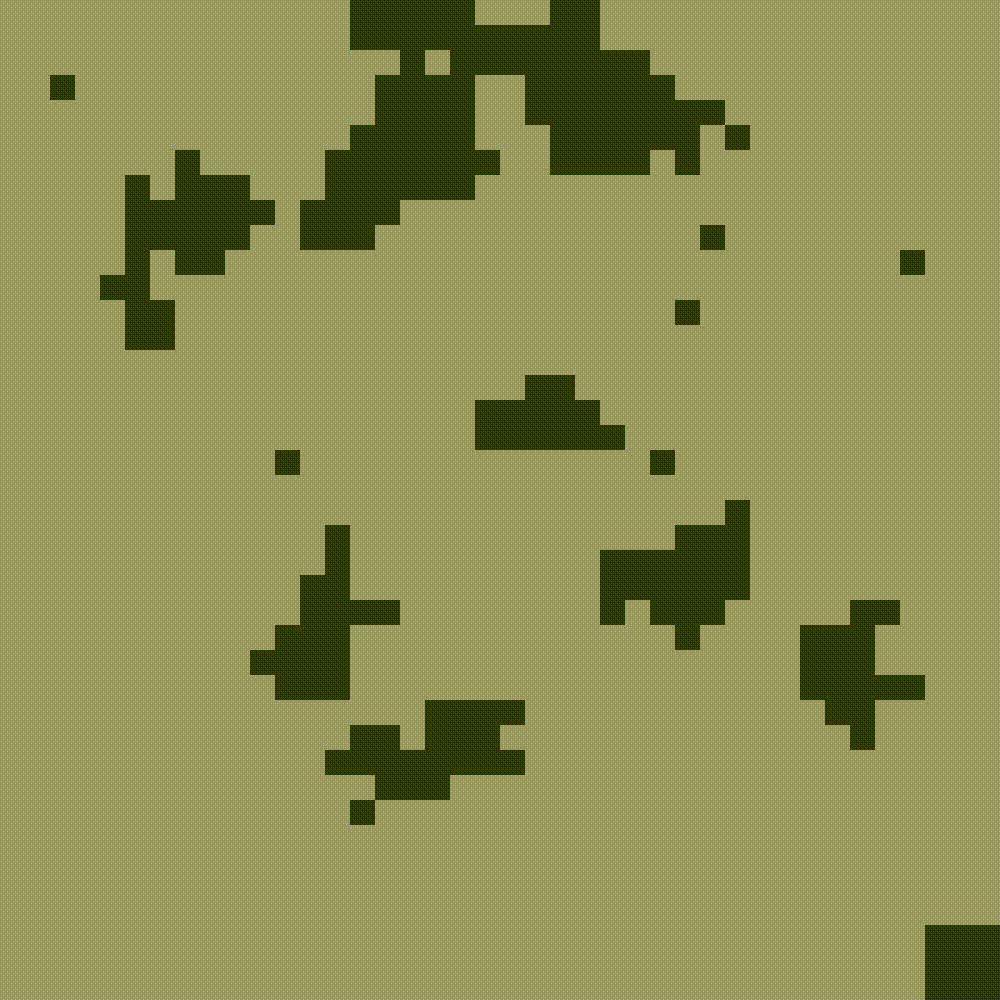
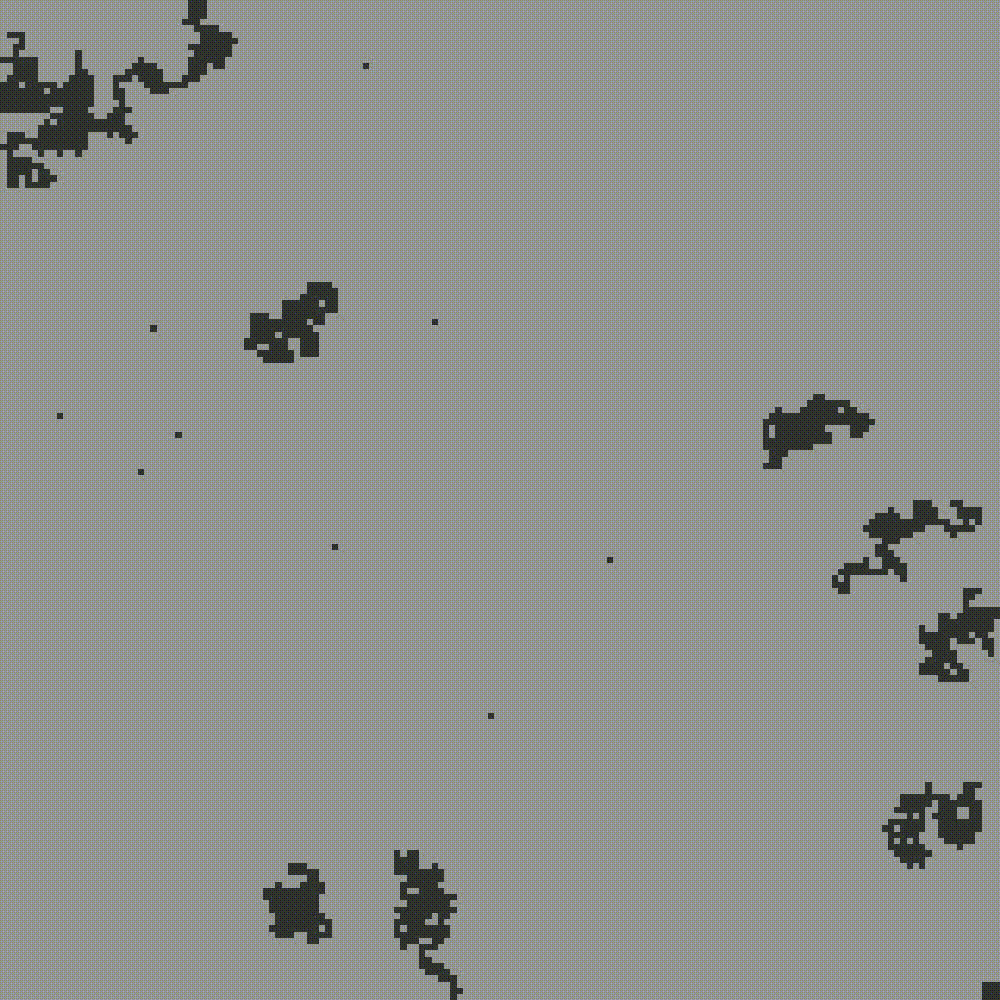
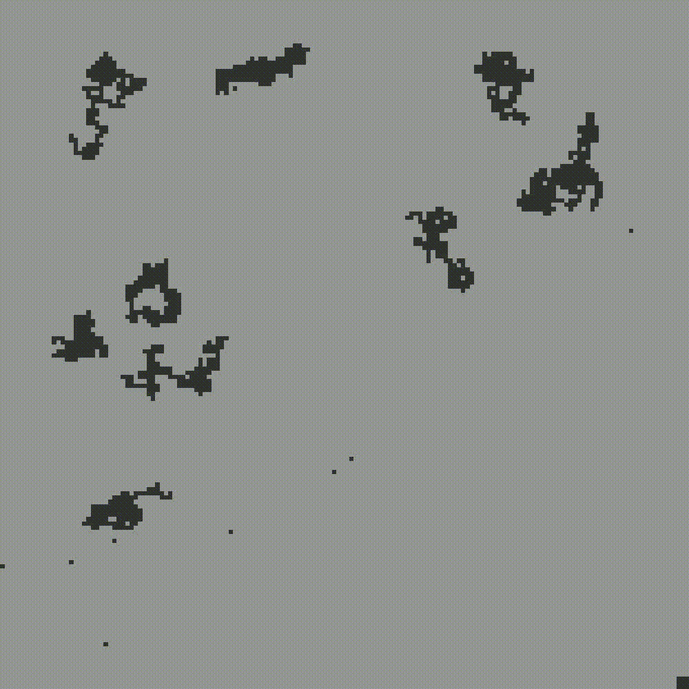

# PolyHacks2025

Système multi-agent visant à optimiser l'exploration de filons minerals. Nous supposons que les agents sont des robots pourvu de capteurs pouvant détecter des minerais de façon non intrusives. L'idée est d'être en mesure d'établir une cartographie des minerais de façons optimal et ce en minimisant le coût et l'impacte écologique.

## Installation

Pour faire/utiliser l'environement:

```sh
python3 -m venv .env
source .env/bin/activate
```

Pour installer les dépendances:

```sh
pip install -r requirements.txt
```

> Pour les devs, pour admettre à jour le requirements.txt: `pip3 freeze > requirements.txt`

## Utilisation

```sh
python3 main.py
```

## Démos

**Premier prototype à l'entraînement:**




**Simulation après 1000 itérations**
| Training | Simulating |
|--|--|
| | |
